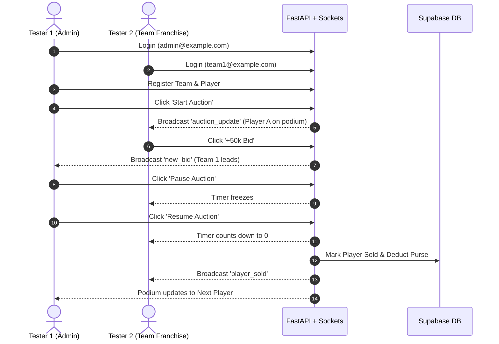

# 🏆 AUCTRA Single Organization Edition — Authoritative Test Execution Plan

**Document Version:** 2.0 (Antigravity Codebase-Aligned & Actionable Edition)  
**Execution Strategy:** Sequential & Collaborative Testing (Tester 1: Admin / Tester 2: Team Bidder)  
**Active Technology Stack:** React 18/19 (Port 3000) + FastAPI / Socket.IO (Port 5000) + Supabase Cloud (PostgreSQL, Auth, Storage)  
**Target Environment:** Localhost / Development & Staging  

---

## 👥 Tester Roles & Setup Guide

To execute these test cases effectively, divide responsibilities between two browser sessions (or two devices):

| Role | Device / Session | Recommended User | Primary View |
| :--- | :--- | :--- | :--- |
| **Tester 1 (Admin Operator)** | Window 1 (Chrome Regular) | `admin@example.com` | `http://localhost:3000/admin_panel` & `/admin_auction` |
| **Tester 2 (Team Bidder)** | Window 2 (Chrome Incognito / Firefox) | `team1@example.com` (or registered team) | `http://localhost:3000/login` -> `/auction` |
| **Public Observer** | Window 3 (Guest / No Login) | Unauthenticated | `http://localhost:3000/` & `/auction` |

---

## 📋 Test Result Recording Template

For each test executed, record results in this format:

```text
Test ID:       [e.g., AUTH-001]
Tester:        [Tester 1 or Tester 2]
Date:          [YYYY-MM-DD]
Status:        [PASS | FAIL | BLOCKED | NOT APPLICABLE]
Actual Result: [Describe what occurred on screen / logs]
Evidence:      [Screenshot / Console Error / Network status code]
```

---

# Phase 0 — Environment & Server Startup

### 🟢 ENV-001: Backend Server Startup
* **Objective**: Verify backend initializes cleanly without unhandled exceptions.
* **Preconditions**: Virtualenv activated, `.env` file present in `JPL-Backend/`.
* **Execution Steps**:
  1. Open terminal in `JPL-Backend/`:
     ```powershell
     uvicorn main:socket_app --port 5000 --reload
     ```
  2. Inspect startup logs in terminal.
* **Expected Result**: Terminal outputs:
  - `INFO: Uvicorn running on http://127.0.0.1:5000`
  - `⚡ Database connection pool pre-warmed on server startup.`
  - No crash, no missing module errors.
* **Pass/Fail Criteria**: Status 200 on `http://127.0.0.1:5000/docs` (Swagger UI opens).

---

### 🟢 ENV-002: Frontend React Startup
* **Objective**: Verify React web application compiles with zero fatal errors.
* **Preconditions**: Node.js installed, dependencies installed in `JPL-frontend/`.
* **Execution Steps**:
  1. Open terminal in `JPL-frontend/`:
     ```powershell
     npm start
     ```
  2. Open browser at `http://localhost:3000`.
  3. Press `F12` to open DevTools -> Console.
* **Expected Result**:
  - Application compiles and launches in browser.
  - Console shows no fatal runtime errors or white screen.
* **Pass/Fail Criteria**: JPL Landing page renders with Navbar and Carousel banner.

---

### 🟢 ENV-003: Environment Variable Audit
* **Objective**: Verify all required keys are documented in `.env.example`.
* **Execution Steps**:
  1. Open `JPL-Backend/.env.example`.
  2. Verify the presence of: `SUPABASE_URL`, `SUPABASE_ANON_KEY`, `SUPABASE_SERVICE_ROLE_KEY`, `SUPABASE_JWT_SECRET`, `SUPABASE_DB_HOST`, `SUPABASE_DB_PASSWORD`.
* **Expected Result**: All keys are present with placeholder documentation.

---

### 🟢 ENV-004: Database Pool Pre-Warming
* **Objective**: Verify PostgreSQL connection pool leases and returns connections.
* **Execution Steps**:
  1. Open browser to `http://localhost:5000/teams`.
  2. Refresh 5 times rapidly.
  3. Inspect backend terminal.
* **Expected Result**: Responses return in < 30ms; no "Connection pool exhausted" errors.

---

# Phase 1 — Navigation & Public Routes

### 🟢 HEALTH-001: Landing Page
* **Execution Steps**: Navigate to `http://localhost:3000/`.
* **Expected Result**:
  - Navbar renders with: JPL Logo, Teams, Players, Live Auction, Login.
  - Image carousel displays Tournament Banners 1, 2, and 3 without broken images.

---

### 🟢 HEALTH-002: Public Navigation
* **Execution Steps**:
  1. Click **Teams** in Navbar (`/teams`).
  2. Click **Players** in Navbar (`/players`).
  3. Click any Player Card -> navigates to `/Player_info/:id`.
  4. Click any Team Card -> navigates to `/team_info/:team_id`.
  5. Click **Live Auction** (`/auction`).
* **Expected Result**: All pages render with appropriate loading spinners and cards. Public auction view shows current player or "Auction is not live".

---

### 🟢 HEALTH-003: Route Redirection (`/home` -> `/`)
* **Execution Steps**: Type `http://localhost:3000/home` directly into browser address bar.
* **Expected Result**: URL automatically rewrites to `http://localhost:3000/` without 404 error (AUDIT-03 fix).

---

### 🟢 HEALTH-004: Protected Route Refresh
* **Execution Steps**:
  1. Login as admin at `http://localhost:3000/login`.
  2. Navigate to `http://localhost:3000/admin_panel`.
  3. Press `F5` (Hard refresh).
* **Expected Result**: Page stays on `/admin_panel` after `/check-auth` completes; user is NOT kicked back to login.

---

# Phase 2 — Authentication

### 🟢 AUTH-001: Valid Admin Login
* **Tester**: Tester 1
* **Execution Steps**:
  1. Navigate to `http://localhost:3000/login`.
  2. Enter valid admin credentials (e.g. `admin@example.com` / `admin_password`).
  3. Click **Login**.
* **Expected Result**:
  - Toast message "Login Successful".
  - Redirects to `http://localhost:3000/admin_panel`.
  - `localStorage.getItem("token")` contains valid Supabase JWT.

---

### 🟢 AUTH-002: Wrong Password Rejection
* **Execution Steps**:
  1. Enter registered email with incorrect password: `WrongPassword123!`.
  2. Click **Login**.
* **Expected Result**:
  - HTTP 401 Unauthorized returned by backend.
  - UI displays error message: "Invalid Credentials or Login Failed".
  - User remains on login page; no token stored.

---

### 🟢 AUTH-003: Unknown Email
* **Execution Steps**:
  1. Enter non-existent email: `nobody_xyz_99@notfound.com` / `password123`.
  2. Click **Login**.
* **Expected Result**: Clean 401 error message without database schema exposure.

---

### 🟢 AUTH-004: Empty Fields Validation
* **Execution Steps**: Click **Login** with blank email or blank password.
* **Expected Result**: HTML5 form validation stops submission ("Please fill out this field").

---

### 🟢 AUTH-005: Logout Action
* **Execution Steps**:
  1. From Admin Panel or Navbar, click **Logout**.
  2. Open DevTools -> Application -> Local Storage.
  3. Attempt to navigate directly to `http://localhost:3000/admin_panel`.
* **Expected Result**:
  - `token` is deleted from LocalStorage.
  - User is redirected to `/login`.

---

### 🟢 AUTH-006: Tampered JWT Signature
* **Execution Steps**:
  1. Open DevTools -> Console.
  2. Corrupt token: `localStorage.setItem("token", "eyJhbGciOiJIUzI1NiIsInR5cCI6IkpXVCJ9.tampered.signature")`.
  3. Refresh page (`F5`).
* **Expected Result**: `GET /check-auth` returns `{"authenticated": false}`. User is redirected to `/login`.

---

# Phase 3 — Role-Based Authorization

### 🟢 AUTHZ-001: Admin Access Privileges
* **Tester**: Tester 1 (Admin)
* **Execution Steps**: Check access to:
  - `http://localhost:3000/admin_panel` (Accessible)
  - `http://localhost:3000/admin_auction` (Accessible)
  - `http://localhost:3000/admin_register` (Accessible)
  - `http://localhost:3000/team_register` (Accessible)
* **Expected Result**: All 4 admin management screens load without redirection.

---

### 🟢 AUTHZ-002: Team User Access to Admin UI (Blocked)
* **Tester**: Tester 2 (Team Account)
* **Execution Steps**:
  1. Log in with team account credentials.
  2. Manually type in address bar: `http://localhost:3000/admin_panel`.
  3. Press Enter.
* **Expected Result**: Protected route catches non-admin role and immediately redirects to `/login` or `/`. Admin dashboard is never displayed.

---

### 🟢 AUTHZ-003: Team Token against Admin REST APIs (Blocked)
* **Execution Steps**:
  1. Copy Team JWT from Tester 2 DevTools.
  2. Send curl command to admin-only endpoint:
     ```bash
     curl -X POST http://localhost:5000/start-auction -H "Authorization: Bearer <TEAM_TOKEN>"
     ```
* **Expected Result**: Backend responds with `HTTP 403 Forbidden` (`Admin access required`).

---

### 🟢 AUTHZ-004: Unauthenticated Socket Bidding (Blocked)
* **Execution Steps**:
  1. Open `http://localhost:3000/auction` as Guest (Tester 3 / No login).
  2. Observe the bidding controls.
* **Expected Result**:
  - Bidding buttons are disabled or prompt for login.
  - Direct socket emissions without valid team token are rejected with `bid_error: "Authentication required to bid"`.

---

# Phase 4 & 5 — Team Management (CRUD)

### 🟢 TEAM-001: Create Team
* **Tester**: Tester 1 (Admin)
* **Execution Steps**:
  1. Navigate to `http://localhost:3000/team_register`.
  2. Enter:
     - Team Name: `Rajasthan Royals Test`
     - Budget / Purse: `10000000` (1 Crore)
     - Logo: Select a valid `.png` or `.jpg` (< 5MB).
  3. Click **Register Team**.
* **Expected Result**:
  - Success alert displays.
  - Team appears immediately at `http://localhost:3000/teams`.
  - Database row inserted in `teams` table with image path in Supabase Storage.

---

### 🟢 TEAM-002: Update Team (`PUT /team/{team_id}`)
* **Tester**: Tester 1
* **Execution Steps**:
  1. Send PUT request (via Admin UI edit button or Postman/curl):
     ```bash
     curl -X PUT http://localhost:5000/team/<TEAM_ID> \
       -H "Authorization: Bearer <ADMIN_TOKEN>" \
       -F "name=Rajasthan Royals Updated" \
       -F "budget=12000000"
     ```
* **Expected Result**: HTTP 200 OK. Navigating to `http://localhost:3000/team_info/<TEAM_ID>` shows updated name and purse.

---

### 🟢 TEAM-003: Delete Team (`DELETE /team/{team_id}`)
* **Tester**: Tester 1
* **Execution Steps**:
  1. Create a dummy team `Delete Me FC`.
  2. Send DELETE request:
     ```bash
     curl -X DELETE http://localhost:5000/team/<TEAM_ID> \
       -H "Authorization: Bearer <ADMIN_TOKEN>"
     ```
* **Expected Result**: HTTP 200 OK. Team is removed from database and storage logo is deleted (STOR-03).

---

# Phase 6 & 7 — Player Management & Storage

### 🟢 PLAYER-001: Single Player Registration
* **Tester**: Tester 1 (Admin)
* **Execution Steps**:
  1. Navigate to `http://localhost:3000/admin_register`.
  2. Fill in details:
     - Name: `Sanju Samson Test`
     - Role: `Batsman`
     - Base Price: `200000` (2 Lakhs)
     - Jersey No: `11`
     - Photo: Select player headshot image.
  3. Click **Register Player**.
* **Expected Result**: Success alert. Player appears in `/players` with WebP converted image.

---

### 🟢 PLAYER-002: Duplicate Jersey Number Check
* **Execution Steps**:
  1. Attempt to register a second player with the exact same Jersey number: `11`.
  2. Click **Register Player**.
* **Expected Result**: Rejected with error message: "Jersey number already taken".

---

### 🟢 PLAYER-003: Update Player (`PUT /players/{player_id}`)
* **Execution Steps**:
  1. Send PUT request updating base price:
     ```bash
     curl -X PUT http://localhost:5000/players/<PLAYER_ID> \
       -H "Authorization: Bearer <ADMIN_TOKEN>" \
       -F "base_price=300000"
     ```
* **Expected Result**: HTTP 200 OK. Player card reflects updated base price.

---

### 🟢 PLAYER-004: Delete Player (`DELETE /players/{player_id}`)
* **Execution Steps**:
  1. Send DELETE request:
     ```bash
     curl -X DELETE http://localhost:5000/players/<PLAYER_ID> \
       -H "Authorization: Bearer <ADMIN_TOKEN>"
     ```
* **Expected Result**: HTTP 200 OK. Player record and Supabase Storage photo are deleted.

---

### 🟢 STORAGE-001: Image File > 5MB Upload Rejection
* **Execution Steps**:
  1. In `admin_register`, attempt to upload an image exceeding 5MB (e.g. 6.2MB photo).
  2. Click **Register Player**.
* **Expected Result**: Rejected immediately with alert: "File size exceeds 5MB limit" (STOR-01).

---

### 🟢 STORAGE-002: Unsupported File Type Rejection
* **Execution Steps**: Attempt to upload a `.pdf` or `.exe` file in player photo upload.
* **Expected Result**: Rejected with validation error ("Unsupported format").

---

### 🟢 STORAGE-003: Broken Image Fallback
* **Execution Steps**:
  1. Open `http://localhost:3000/players`.
  2. If an image fails to load or path is invalid, observe the card avatar.
* **Expected Result**: Card displays default silhouette avatar (`/fallback_player.png`) without broken image icon (STOR-02).

---

# Phase 8 & 9 — Auction Control & Lifecycle

### 🟢 AUCTION-001: Start Live Auction
* **Setup**: Tester 1 on `/admin_auction`, Tester 2 on `/auction`.
* **Execution Steps**:
  1. Tester 1 clicks **Start Auction**.
* **Expected Result**:
  - Live timer begins counting down (e.g. 30s).
  - Both Tester 1 and Tester 2 screens update simultaneously via WebSocket event `auction_update`.
  - Active player's name, category, and base price are displayed on both screens.

---

### 🟢 AUCTION-002: Live Countdown Synchronization
* **Execution Steps**: Observe the countdown timer on Tester 1 and Tester 2 simultaneously.
* **Expected Result**: Both devices show the identical remaining seconds (± 1 second variance).

---

### 🟢 AUCTION-003: Pause & Resume Auction
* **Execution Steps**:
  1. Tester 1 clicks **Pause Auction** at 18 seconds.
  2. Wait 5 seconds.
  3. Tester 1 clicks **Resume Auction**.
* **Expected Result**:
  - Timer stops at 18 seconds on all connected screens (AUCT-04).
  - Upon resume, timer continues counting down from 18 seconds without double-speed or duplicate background tasks.

---

### 🟢 AUCTION-004: Undo Sale (`POST /undo-sale`)
* **Execution Steps**:
  1. Complete sale of a player to Team A for ₹50,00,000.
  2. Note Team A's purse: decreases by ₹50,00,000.
  3. Tester 1 clicks **Undo Sale** (or calls `POST /undo-sale`).
* **Expected Result**:
  - Team A's purse is refunded by ₹50,00,000.
  - Player is removed from `sold_players` table and returned to available auction pool (AUCT-02).

---

### 🟢 AUCTION-005: Restart Specific Player (`POST /restart-player`)
* **Execution Steps**:
  1. Identify an unsold or mistakenly sold player ID.
  2. Send restart command:
     ```bash
     curl -X POST http://localhost:5000/restart-player?player_id=<PLAYER_ID> \
       -H "Authorization: Bearer <ADMIN_TOKEN>"
     ```
* **Expected Result**: Player state resets to `unsold=False, is_sold=False`, ready to be placed on the auction podium again (AUCT-03).

---

# Phase 10 — Real-Time Bidding Mechanics

### 🟢 BID-001: Valid Live Bid Placement
* **Setup**: Active player with base price ₹1,00,000.
* **Tester**: Tester 2 (Team Franchise).
* **Execution Steps**:
  1. Tester 2 clicks **+ ₹50,000 Bid**.
* **Expected Result**:
  - Current bid becomes ₹1,50,000.
  - Leading team displays Tester 2's Team Name.
  - Bidding notification log displays: `🕒 [Time] — [Team Name] bid ₹1,50,000`.
  - Notification updates in real time on Tester 1's admin dashboard.

---

### 🟢 BID-002: Exceeding Team Purse Rejection
* **Execution Steps**:
  1. Set Team purse to ₹2,00,000.
  2. Attempt to place a bid of ₹2,50,000.
* **Expected Result**:
  - Bid rejected with error toast: "Insufficient team purse".
  - Bid amount does not advance; database purse remains unchanged.

---

### 🟢 BID-003: Bid Identity Spoofing Protection
* **Execution Steps**:
  1. Using DevTools Console in Tester 2's session, manually emit a bid pretending to be Team ID 99:
     ```javascript
     socket.emit("place_bid", { token: "<MY_TEAM_TOKEN>", team_id: 99, bid_amount: 500000 });
     ```
* **Expected Result**: Server derives identity exclusively from the verified JWT payload; team_id 99 is ignored or rejected.

---

### 🟢 BID-004: Bidding After Expiry Rejection
* **Execution Steps**:
  1. Wait until timer reaches `00:00`.
  2. Tester 2 rapidly clicks Bid button.
* **Expected Result**: Bid is rejected; server returns `bid_error: "Auction has already ended"`.

---

### 🟢 BID-005: Rapid Double-Click Concurrency
* **Execution Steps**: Rapidly click bid button 5 times within 500 milliseconds.
* **Expected Result**: Only the valid incremental bid(s) are processed in serial order; team is not self-outbid, and purse does not double-deduct.

---

# Phase 11 — WebSocket Reliability

### 🟢 WS-001: Browser Refresh During Live Auction
* **Execution Steps**:
  1. While a player is on the podium with active bids, press `F5` on Tester 2 (Bidder).
* **Expected Result**:
  - Browser reconnects to Socket.IO.
  - Dispatches `join_auction`.
  - Page immediately repopulates with the correct active player, current leading bid, and remaining timer.

---

### 🟢 WS-002: Network Reconnection Resilience
* **Execution Steps**:
  1. In Chrome DevTools -> Network -> Throttling -> Set to **Offline** for 3 seconds.
  2. Switch back to **No Throttling** (Online).
* **Expected Result**: Socket automatically re-establishes connection and syncs latest auction state.

---

# Phase 12 — Database Integrity

### 🟢 DB-001: Atomic Transaction Rollback on Failure
* **Objective**: Verify `self._conn.rollback()` prevents dirty connection state in pool.
* **Execution Steps**:
  1. Trigger an intentional SQL constraint violation (e.g. duplicate jersey).
  2. Inspect backend logs.
  3. Execute a subsequent normal query.
* **Expected Result**: Connection was rolled back before release (DB-01); subsequent pooled requests succeed cleanly without lingering aborted transactions.

---

### 🟢 DB-002: Foreign Key Index Verification
* **Execution Steps**: Open Supabase SQL Editor and run:
  ```sql
  SELECT indexname, tablename FROM pg_indexes WHERE schemaname = 'public';
  ```
* **Expected Result**: Indexes `idx_bids_player_id`, `idx_bids_team_id`, `idx_sold_players_team_id`, and `idx_users_team_id` are all present (DB-02 / PERF-02).

---

# Phase 14 — Security Audit Checks

### 🟢 SEC-001: SQL Injection in Search Inputs
* **Execution Steps**:
  1. Navigate to `/players`.
  2. In search box, type: `' OR '1'='1' --` and `1; DROP TABLE teams;`.
* **Expected Result**: Handled as plain string literals; no syntax errors, no unexpected records returned.

---

### 🟢 SEC-002: XSS (Cross-Site Scripting) Payload
* **Execution Steps**:
  1. Register player with name `<script>alert('XSS')</script>`.
  2. View player card in `/players` and `/auction`.
* **Expected Result**: React renders text literally; script does NOT execute; no alert modal pops up.

---

### 🟢 SEC-003: Secret Exposure Audit
* **Execution Steps**:
  1. Open DevTools -> Sources -> Search (`Ctrl + Shift + F`).
  2. Search for: `SUPABASE_SERVICE_ROLE_KEY` or `postgres://` or database passwords.
* **Expected Result**: Zero occurrences found in client-side bundle. Only public `anon` key is bundled.

---

# Phase 15 — Rate Limiting (Redis)

> [!NOTE]
> **Status: DEFERRED / BLOCKED UNTIL REDIS DEPLOYMENT**  
> The current system operates with in-memory auction coordination and PostgreSQL connection pooling. Test cases `REDIS-001` through `REDIS-005` will be activated once Redis container / cloud instance is provisioned.

---

# Phase 16 — UI / UX & Accessibility

### 🟢 UI-001: Mobile 320px Viewport Integrity
* **Execution Steps**:
  1. Open DevTools -> Toggle Device Toolbar (`Ctrl + Shift + M`).
  2. Select **Responsive** -> Width: `320px`, Height: `640px`.
  3. Navigate through `/`, `/auction`, `/teams`, `/players`.
* **Expected Result**: No horizontal scrollbar appears; bidding buttons stack cleanly; no overlapping cards (UI-01).

---

### 🟢 UI-002: Long Text Truncation
* **Execution Steps**:
  1. Register team with name: `The Incredibly Long Champions Club of North West Jaipur Premier League`.
  2. View team card.
* **Expected Result**: Text truncates with ellipsis (`...`) and full name displays on mouse hover tooltip (UI-02).

---

### 🟢 UI-003: Image `alt` Attribute Verification
* **Execution Steps**:
  1. Right-click any image in Navbar, Player Card, Team Card, or Auction podium -> **Inspect**.
* **Expected Result**: All `` tags possess descriptive `alt` text (e.g. `alt="Sanju Samson photo"`) instead of empty or missing tags (AUDIT-10).

---

# Phase 19 — Complete Live Auction Simulation (End-to-End)

Follow this 12-step live tournament rehearsal with your teammate:



1. **Step 1**: Tester 1 logs into Admin Dashboard.
2. **Step 2**: Tester 2 logs into Team Portal.
3. **Step 3**: Tester 1 creates team "Challengers" with ₹1,00,00,000 budget.
4. **Step 4**: Tester 1 registers player "Rahul Sharma" (Base Price: ₹5,00,000).
5. **Step 5**: Tester 1 navigates to `/admin_auction` and clicks **Start Auction**.
6. **Step 6**: Tester 2 observes Rahul Sharma appear live on `/auction`.
7. **Step 7**: Tester 2 places bid of ₹5,50,000.
8. **Step 8**: Tester 1 observes leading bid update in real time.
9. **Step 9**: Tester 1 pauses auction for 5 seconds and resumes it.
10. **Step 10**: Timer reaches `00:00`; server emits `player_sold`.
11. **Step 11**: Tester 2 verifies their team purse reduced to ₹94,50,000.
12. **Step 12**: Tester 1 clicks **Sold Players** (`/sold`) and verifies Rahul Sharma is listed under Challengers.

---

## 🎯 Final Sign-off Checklist

- [ ] All Phase 0 Startup checks PASSED
- [ ] All Phase 2 & 3 Auth/AuthZ checks PASSED
- [ ] Team & Player CRUD verified with image uploads
- [ ] Live Bidding & Countdown synchronized across both devices
- [ ] Undo Sale and Player Restart confirmed working
- [ ] Zero critical console errors or unhandled exceptions
- [ ] **Release Recommendation**: Ready for Live JPL Tournament Event!
